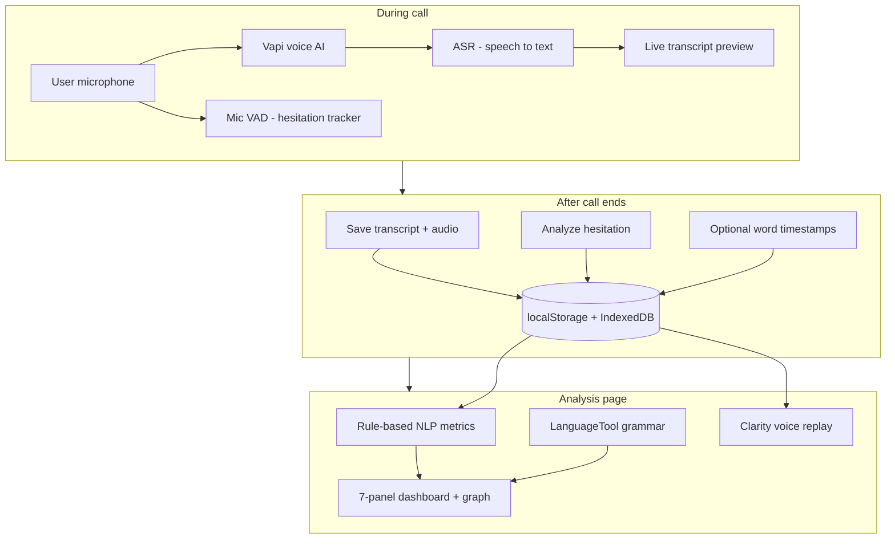

# Interview Guide — Spoken English Proficiency Analytics

> **Use this file to prepare for HR, technical, or viva questions.**  
> Written in plain English. For formulas and file paths, see `PROJECT_DOCUMENTATION.md`.

---

## 1. Elevator pitch (30 seconds)

We built a **web app that helps people practice spoken English** and get **clear, measurable feedback**.

The user talks to a **live AI voice assistant** (like a mock interview or conversation). Their speech is turned into **text**. Our app then analyzes that text for **fillers, speed, vocabulary, grammar, clarity, and hesitation** — and shows scores, charts, and coaching tips.

We also have **sentence drills**, **picture description tasks**, and **progress graphs** so users can improve over time.

**Tech:** Next.js (React), TypeScript, Vapi for voice, browser storage — no login required for the demo.

---

## 2. What is ASR? (Simple answer for interviews)

**ASR = Automatic Speech Recognition.**

It means: **computer listens to your voice and writes down the words** (speech → text).

| Where we use ASR | Service |
|------------------|---------|
| Live practice call | **Vapi** (uses a cloud STT engine, often Deepgram on their side) |
| Sentence drills | **Browser Web Speech API** first; **OpenAI Whisper** if that fails |
| Picture talk | **Web Speech API** |
| Clarity voice replay (optional) | **Deepgram or Whisper** on our saved recording — only for **word timestamps**, not for main scores |

**Important line for interviews:**  
*“We do not build our own speech recognition model. We use proven ASR services, then we run our own analysis on the text (and a small amount of audio processing for hesitation and replay).”*

---

## 3. Real-time or after the call?

**Both — but for different things.**

| When | What happens |
|------|----------------|
| **During the call (real-time)** | Vapi streams **live transcript** on screen (last few lines). Mic tracks **mid-answer hesitation** (when you pause mid-sentence). No full score yet. |
| **When call ends** | Transcript is cleaned and saved. Audio is saved. Hesitation is analyzed. Optional word-level alignment runs. User is sent to **Analysis** page. |
| **On Analysis page** | **All main metrics are computed** from saved transcript (fillers, fluency, vocabulary, clarity, etc.). Grammar is checked via API. This is **after the call**, in the browser. |

**One-line answer:**  
*“Live feedback is the transcript preview and hesitation indicator. Full scoring and breakdowns run after the call ends — usually within a few seconds.”*

We do **not** run the full NLP dashboard in real time during the call (that would be heavy and noisy). Real-time ASR is only for **capturing words** and **live preview**.

---

## 4. End-to-end flow (practice session)

```
1. User opens /practice
2. Starts Vapi call → speaks English
3. Vapi sends transcript events (partial + final)
4. We save only FINAL user text (avoid duplicates)
5. Mic records user audio in parallel
6. User ends call
7. We save:
   - transcript (localStorage)
   - call duration
   - conversation turns (user + AI)
   - audio file (IndexedDB)
   - hesitation data from mic
   - optional word timestamps (Deepgram/Whisper)
8. Redirect to /analysis
9. Browser computes all scores + shows 7 panels
10. Grammar API called in background
11. Session added to trend graph
```

---

## 5. How each metric is analyzed (plain English)

All **main practice scores** use the **user transcript** (your words only, not the AI’s).

### 5.1 Fluency score

**What it measures:** How smooth your speech looks on paper — fewer fillers and fewer repeated words = higher score.

**How:**
- Count **filler words** (um, uh, like, you know, etc.)
- Count **back-to-back repeats** (e.g. “I I think”, “the the”)
- Penalties are **rate-based** (per word), so long speeches are not unfairly punished

**File:** `app/analysis/page.tsx` → `computeBasicMetrics()`

---

### 5.2 Words per minute (WPM)

**What it measures:** Speaking speed.

**How:**  
`word count ÷ call duration in minutes`  
Duration comes from wall-clock time when the call started and ended.

---

### 5.3 Overall score (0–100)

**What it measures:** One headline number for the session.

**How:** Weighted mix of:
- Fluency (45%)
- Vocabulary richness (25%)
- Low hesitation from fillers (15%)
- Low repetition (7.5%)
- Low total fillers (7.5%)

**File:** `computeOverallScore()` in `app/analysis/page.tsx`

---

### 5.4 Vocabulary / lexical richness

**What it measures:** Did you use varied words or repeat the same ones?

**How:**
- **TTR** = unique words ÷ total words
- **MATTR** = same idea but averaged over sliding windows (fairer for long text)
- Label: *limited / moderate / rich*
- **CEFR tags:** Common words mapped to levels A1–C2; average gives a vocabulary band estimate

**Files:** `computeLexicalDiversity()` in analysis page; `lib/cefrWordLevels.ts`

---

### 5.5 Fillers

**What it measures:** How often you use hesitation words and where (start, middle, or end of sentences).

**How:** Rule-based lists + regex:
- Single words: um, uh, like, actually, basically…
- Phrases: you know, I mean, kind of, sort of
- “Well / so / okay” counted mainly at **sentence start**

**File:** `computeFillerPatterns()` + `lib/analysisDetails.ts` → `extractFillerBreakdown()`

---

### 5.6 Repetitions (disfluency)

**What it measures:** When you say the same word or short phrase twice in a row.

**How:** Regular expressions on the transcript, e.g. `word word` or `two words two words`.

**File:** `countRepetitions()` + `extractRepetitionBreakdown()`

---

### 5.7 Clarity (restarts, incomplete sentences, hedging)

**What it measures:** How clear and direct your message is.

| Signal | Example | How we detect |
|--------|---------|----------------|
| **Sentence restart** | “I… I mean I went” | Repeated word/phrase patterns |
| **Incomplete sentence** | Ends with “and…”, very short fragment | Ellipsis, dashes, trailing conjunctions, ≤2 words |
| **Hedging** | “I think”, “maybe”, “kind of” | Phrase list + regex |

**Levels:** Low / Medium / High based on counts.

**Click breakdown:** Shows **highlighted sentences** + **voice replay** (your recording at that moment).

**File:** `computeClarityCountMetrics()` + `lib/analysisDetails.ts`

---

### 5.8 Rhythm / mid-answer hesitation

**What it measures:** When you **stop in the middle of your answer** (searching for a word), then continue — **not** silence while the AI talks.

**How (best case):**  
Mic **VAD** (voice activity detection) during the call tracks answer windows and pauses.

**How (fallback):**  
If no mic data, estimate from transcript markers (`...`, `—`, commas).

**File:** `lib/answerHesitationPauses.ts`, `lib/pauseRhythm.ts`

---

### 5.9 Grammar

**What it measures:** Obvious grammar/spelling issues in the transcript.

**How:** Transcript sent to **LanguageTool** API (`/api/grammar`). Issue count → grammar score.

**Note:** This is **after the call**, async — does not block other metrics.

---

### 5.10 Communication radar (6 axes)

**What it measures:** Visual spider chart — vocabulary, fluency, grammar, coherence, clarity, confidence.

**How:** **Derived from metrics above** — formulas, not a separate ML model. Does **not** change the overall score.

**File:** `lib/communicationRadar.ts`

---

### 5.11 Coach cards

**What it measures:** Nothing new — gives **tips** based on thresholds.

**How:** Rule-based if/else (“if fillers high → suggest …”). Up to 2 strengths + 3 next steps.

**File:** `lib/coachTips.ts`

---

### 5.12 Session trend graph

**What it measures:** Progress over multiple practice calls.

**How:** Each analysis visit saves overall score + date in `localStorage`. SVG chart on `/analysis/graph`.

**File:** `lib/sessionHistory.ts`

---

### 5.13 Clarity voice replay

**What it does:** Play **your real voice** when you click a flagged sentence.

**How:**
1. Full mic recording saved at call end
2. Optional **word timestamps** from Deepgram/Whisper (`/api/transcribe/align`)
3. Map flagged sentence → `startSec` / `endSec`
4. Play that slice; show **transcript text** (before + flagged + after)

**This is for UX replay — not for calculating fluency score.**

---

## 6. Other features (not the main Vapi analysis)

### Sentence drills (`/drills`)

- User reads a sentence aloud
- ASR: Web Speech or Whisper
- **Scoring:** Compare user text to reference with **edit distance** + phonetic forgiveness (sounds-alike words)
- Pass / soft pass / retry tiers

### Picture talk (`/picture-talk`)

- Describe an image for **60 seconds**
- Rubric: scene detail, fluency, fillers, pace — **fixed weights**, comparable across images

### Prompt roulette (`/prompts`)

- Random speaking topic — warm-up only, no scoring

---

## 7. What uses AI / ML vs simple rules?

| Part | Type | Interview phrase |
|------|------|------------------|
| Fillers, repeats, clarity, TTR, overall score | **Rules + statistics** | “Explainable NLP” |
| Coach tips, radar (except grammar) | **Rules** | “Expert system” |
| Drill matching | **Edit distance** | “String algorithms” |
| Live voice call | **Vapi (hosted AI)** | “Third-party voice platform” |
| ASR | **Vapi / Web Speech / Whisper** | “We consume ASR, we don’t train it” |
| Grammar check | **LanguageTool API** | “External grammar service” |
| Word timestamps for replay | **Deepgram / Whisper** | “Post-call alignment only” |
| Mid-answer hesitation | **Audio VAD** | “Signal processing, not deep learning” |

**Honest line:**  
*“Core proficiency analytics are transcript-based and rule-driven so scores are fast, free, and explainable. Audio ML is used only where text is weak: hesitation timing and synced replay.”*

---

## 8. Where is data stored?

| Data | Storage |
|------|---------|
| Transcript, duration, conversation, word timestamps, session history | **Browser localStorage** |
| Full call audio, per-segment clips | **Browser IndexedDB** |
| User accounts / cloud DB | **Not in this demo** |

**Privacy answer:** *“Session data stays on the user’s device unless they clear browser data.”*

---

## 9. Common interview questions & short answers

### “What is your project?”
A spoken English practice app with live AI calls and automatic feedback on fluency, vocabulary, clarity, and grammar — plus drills and progress charts.

### “What is ASR?”
Automatic Speech Recognition — converting speech to text. We use Vapi during calls and optional Deepgram/Whisper for alignment.

### “Do you analyze in real time?”
Partially. Live transcript appears during the call. **Full analysis runs after the call ends** in the browser.

### “Why transcript-based instead of audio?”
Faster, cheaper, explainable, and good enough for fillers, vocabulary, and clarity. We add **audio only** for hesitation and voice replay.

### “How do you handle duplicate transcript text from streaming?”
We keep **final** segments only, merge overlapping chunks, and deduplicate similar sentences (Jaccard similarity).

### “What is TTR / MATTR?”
Type–Token Ratio — unique words divided by total words. MATTR smooths this over a sliding window so long speeches are scored fairly.

### “How is overall score calculated?”
Weighted combination of fluency, vocabulary richness, and penalties for fillers and repetitions — all from the transcript.

### “What is Vapi?”
A platform that connects microphone, speech-to-text, AI brain, and text-to-speech for real-time voice conversations in the browser.

### “Did you use machine learning?”
We use **hosted ML services** (Vapi, optional Whisper/Deepgram, LanguageTool). Our **own scoring logic is rule-based**, not a trained neural network.

### “What would you improve next?”
Word-level timestamps from every call, cloud storage, user accounts, pronunciation scoring from audio, export PDF reports.

### “What was the hardest part?”
Aligning **recorded audio** with **transcript text** for replay — solved with post-call Deepgram word timestamps and per-segment clips.

### “Who is the target user?”
English learners, interview candidates, or therapy/coaching scenarios — anyone who needs **structured speaking practice with numbers, not just subjective feedback**.

---

## 10. Tech stack (one table)

| Layer | Choice |
|-------|--------|
| Frontend | Next.js 16, React 19, TypeScript, Tailwind |
| Voice practice | Vapi Web SDK |
| Analysis engine | Client-side JavaScript (regex, token math) |
| Grammar | LanguageTool via `/api/grammar` |
| Optional align | Deepgram or Whisper via `/api/transcribe/align` |
| Storage | localStorage + IndexedDB |

---

## 11. Key files (if interviewer asks “show me the code”)

| Topic | File |
|-------|------|
| Vapi call + save transcript | `app/practice/page.tsx` |
| All practice metrics & overall score | `app/analysis/page.tsx` |
| Dashboard UI (7 panels) | `components/analysis/AnalysisDashboard.tsx` |
| Filler/repeat/clarity breakdowns | `lib/analysisDetails.ts` |
| Transcript deduplication | `lib/practiceTranscript.ts` |
| Mid-answer hesitation | `lib/answerHesitationPauses.ts` |
| Word timestamps | `lib/practiceWordAlignment.ts`, `app/api/transcribe/align/route.ts` |
| Radar & coach | `lib/communicationRadar.ts`, `lib/coachTips.ts` |
| Drills scoring | `lib/drillCompare.ts` |
| Picture talk rubric | `lib/pictureTalkRubric.ts` |

---

## 12. Architecture diagram (for whiteboard / slide)



---

## 13. Related documents

| File | Best for |
|------|----------|
| **INTERVIEW_GUIDE.md** (this file) | HR / viva / simple explanations |
| **PROJECT_DOCUMENTATION.md** | Deep technical report, formulas |
| **README.md** | Setup, install, run locally |

---

*Last updated for current features: Vapi practice, 7-panel analysis, audio hesitation, CEFR vocabulary, Deepgram word-align replay, drills, picture talk.*
